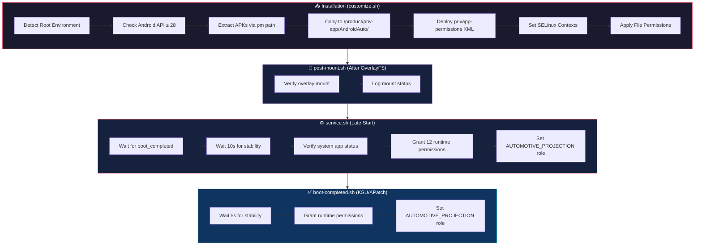

# 🚗 Android Auto Systemizer — Magisk / KernelSU / KernelSU Next Module

<p align="center">
  
  
  
</p>

<p align="center">
  <a href="https://github.com/topjohnwu/Magisk"></a>
  <a href="https://github.com/tiann/KernelSU"></a>
  <a href="https://github.com/rifsxd/KernelSU-Next"></a>
  <a href="https://github.com/bmax121/APatch"></a>
</p>

<p align="center">
  <b>A high-performance systemless module that converts Android Auto into a fully privileged system application with automotive projection capabilities.</b>
</p>

<p align="center">
  Systemless Install • Auto APK Extraction • Privileged Permissions • SELinux Compliant • Multi-Root Support
</p>

---

## 📋 Table of Contents

- [Overview](#-overview)
- [Features](#-features)
- [Compatibility](#-compatibility)
- [Installation](#-installation)
- [Architecture & Boot Lifecycle](#-architecture--boot-lifecycle)
- [Script Details](#-script-details)
- [Permissions](#-permissions)
- [Project Structure](#-project-structure)
- [OTA Updates](#-ota-updates)
- [Troubleshooting](#-troubleshooting)
- [Changelog](#-changelog)
- [Credits](#-credits)

---

## 🔍 Overview

**Android Auto Systemizer** is a root module that systemlessly converts the Android Auto application (`com.google.android.projection.gearhead`) from a regular user app into a **privileged system app** (`priv-app`).

This is necessary because many Android Auto features — such as **automotive projection**, **USB accessory access**, **background location**, and **persistent foreground services** — require system-level privileges that are only available to apps installed in `/system/product/priv-app/`.

The module:

1. **Extracts** the installed Android Auto APK(s) automatically from the device
2. **Installs** them systemlessly into `/system/product/priv-app/AndroidAuto/`
3. **Configures** a comprehensive XML allowlist granting 40+ privileged permissions
4. **Applies** custom SELinux policies for USB device access and binder communication
5. **Grants** runtime (dangerous) permissions automatically on each boot
6. **Registers** Android Auto as the system automotive projection handler

---

## ✨ Features

| Feature | Description |
| :--- | :--- |
| 📦 **Auto APK Extraction** | Automatically extracts installed Android Auto APKs (including split APKs) via `pm path` |
| 🔐 **Privileged Permissions** | Full XML allowlist with 40+ privileged permissions for system-level access |
| 🛡️ **SELinux Compliant** | Custom SEPolicy rules for USB device access and binder IPC |
| 🔑 **Runtime Permission Grant** | Automatically grants 12 dangerous permissions (location, phone, contacts, bluetooth, etc.) on boot |
| 🚗 **Automotive Projection Role** | Registers Android Auto as `SYSTEM_AUTOMOTIVE_PROJECTION` role holder |
| 🔄 **Split APK Support** | Full support for Android App Bundles with multiple split APKs |
| 📁 **Fallback APK Input** | Users can manually include APKs in the ZIP if Android Auto is not yet installed |
| 🔒 **Post-Mount Verification** | Validates OverlayFS mount on KernelSU/KSU Next after boot |
| 🧹 **Clean Uninstall** | Clears Android Auto cache on removal to prevent conflicts |
| 🔁 **Auto-Update** | In-app update support via `updateJson` for all root managers |

---

## 🔧 Compatibility

### Root Solutions

| Platform | Version | Status |
| :--- | :--- | :--- |
| **Magisk** | 20.0+ | ✅ Full Support |
| **KernelSU** | All | ✅ Full Support (requires metamodule) |
| **KernelSU Next** | 20000+ | ✅ Full Support (requires metamodule) |
| **APatch** | All | ✅ Full Support |

### Android Versions

| Android | API | Status | Notes |
| :--- | :--- | :--- | :--- |
| Android 9 | API 28 | ✅ | Minimum supported version |
| Android 10 | API 29 | ✅ | — |
| Android 11 | API 30 | ✅ | — |
| Android 12 | API 31 | ✅ | — |
| Android 12L | API 32 | ✅ | — |
| Android 13 | API 33 | ✅ | — |
| Android 14 | API 34 | ✅ | — |
| Android 15 | API 35 | ✅ | — |
| Android 16 | API 36 | ✅ | — |

### Tested ROMs

Works on AOSP, Pixel, LineageOS, crDroid, EvolutionX, AxionOS, MIUI, HyperOS, OneUI, OxygenOS, ColorOS, and more.

> [!IMPORTANT]
> **KernelSU / KernelSU Next users:** You **MUST** install a metamodule (e.g., `meta-overlayfs`) for the module to mount files into `/system/`. The installer will warn you if none is detected.

---

## 🚀 Installation

1. **Install Android Auto** from the [Google Play Store](https://play.google.com/store/apps/details?id=com.google.android.projection.gearhead) (if not already installed)
2. Download the latest `AndroidAuto_Systemizer.zip` from [Releases](https://github.com/antoniomalheirs/AndroidAuto_Systemizer/releases)
3. Open your root manager (**Magisk Manager**, **KernelSU Manager**, or **APatch**)
4. Flash the `.zip` via the **Modules** → **Install from storage** option
5. **Reboot** your device
6. (Optional) Uninstall the Play Store version of Android Auto — the system version takes priority
7. Connect to your car and enjoy! 🎉

> [!NOTE]
> The module automatically extracts Android Auto's APK(s) during installation. You do **not** need to manually place any APK files. If Android Auto is not installed, the installer will provide instructions.

> [!TIP]
> After rebooting, you can verify the systemization worked by checking: **Settings → Apps → Android Auto → App Info** — it should show as a **System App**.

---

## 🏗️ Architecture & Boot Lifecycle

The module uses a multi-stage boot pipeline to ensure Android Auto gains full system privileges across all root solutions:



### Why Multiple Stages?

| Stage | Timing | Purpose |
| :--- | :--- | :--- |
| `customize.sh` | During flash | Extract APKs, deploy permissions, set file contexts |
| `post-mount.sh` | After OverlayFS mount | Verify overlay mounted correctly (KSU/APatch) |
| `service.sh` | Late start (boot completed) | Grant runtime permissions, set projection role |
| `boot-completed.sh` | After `sys.boot_completed=1` (KSU/APatch) | Re-apply permissions via native KSU hook |

---

## 📜 Script Details

### `customize.sh` — Installation Engine

The installation script adapts to the device environment:

- **Root Detection:** Identifies Magisk, KernelSU, KernelSU Next, or APatch with version logging
- **API Validation:** Enforces minimum Android 9 (API 28) requirement
- **APK Extraction:** Uses `pm path` to locate and copy all Android Auto APKs (base + splits)
- **Fallback Support:** If Android Auto is not installed, checks for manually included APKs in the ZIP
- **Permission Deployment:** Copies the privileged permissions XML to `/system/product/etc/permissions/`
- **SELinux Enforcement:** Applies correct file contexts via `set_perm_recursive`

### `post-mount.sh` — Overlay Verification (KSU/APatch)

Runs AFTER OverlayFS/MagicMount has mounted module files.

- Validates that `/system/product/priv-app/AndroidAuto/` is mounted and accessible
- Logs mount status for debugging

### `service.sh` — Late Start Service (Universal)

The main runtime script. Waits for `sys.boot_completed=1` + 10s stabilization before executing.

- **System App Verification:** Checks if Android Auto is recognized as a system package via `pm list packages -s`
- **Runtime Permission Grant:** Grants 12 dangerous permissions that cannot be declared in XML allowlists
- **Projection Role:** Registers Android Auto as `SYSTEM_AUTOMOTIVE_PROJECTION` via `cmd role`
- **Logging:** All actions logged via Android's `log` system with tag `AndroidAutoSystemizer`

### `boot-completed.sh` — Post-Boot Hook (KSU/APatch)

KernelSU and APatch support this hook natively. Provides a redundant path for permission granting.

- Re-applies all 12 runtime permissions
- Re-registers the automotive projection role
- Ensures permissions persist even if `service.sh` runs too early

### `sepolicy.rule` — SELinux Policy

Custom SEPolicy rules that allow:

- `priv_app` domain to access USB character devices (`chr_file { read write open ioctl getattr }`) — required for wired car connections
- `priv_app` domain to communicate with `system_server` via binder IPC — required for projection services

### `system.prop` — System Properties

Intentionally empty. Android Auto's privileged functionality relies on XML permission allowlisting and runtime grants, not custom system properties.

### `uninstall.sh` — Clean Removal

Clears Android Auto's cache and data on module removal to prevent conflicts when reverting to the user-space version.

---

## 🔑 Permissions

### Privileged Permissions (XML Allowlist)

The module deploys a comprehensive `privapp-permissions` XML that grants Android Auto access to system-level APIs:

<details>
<summary><b>Full Permission List (40+ permissions)</b></summary>

| Category | Permission | Purpose |
| :--- | :--- | :--- |
| 📍 Location | `ACCESS_FINE_LOCATION` | GPS for navigation |
| 📍 Location | `ACCESS_COARSE_LOCATION` | Network location |
| 📍 Location | `ACCESS_BACKGROUND_LOCATION` | Navigation while screen off |
| 📞 Phone | `READ_PHONE_STATE` | Call state detection |
| 📞 Phone | `CALL_PHONE` | Hands-free calling |
| 📞 Phone | `READ_PHONE_NUMBERS` | Caller ID display |
| 📇 Contacts | `READ_CONTACTS` | Contact sync to car display |
| 🎙️ Audio | `RECORD_AUDIO` | Voice commands / Google Assistant |
| 🔔 Notifications | `POST_NOTIFICATIONS` | Android 13+ notification permission |
| 📶 Bluetooth | `BLUETOOTH_CONNECT` | Android 12+ BT connection |
| 📶 Bluetooth | `BLUETOOTH_SCAN` | Android 12+ BT discovery |
| 📡 WiFi | `NEARBY_WIFI_DEVICES` | Wireless Android Auto |

</details>

### Runtime Permissions (Granted on Boot)

The 12 dangerous permissions listed above are also granted automatically via `pm grant` in `service.sh` and `boot-completed.sh` to ensure zero-touch configuration.

---

## 📂 Project Structure

```
AndroidAuto_Systemizer/
├── META-INF/                          # Flashable ZIP metadata
│   └── com/google/android/
│       ├── update-binary             # Magisk module installer
│       └── updater-script            # Required (empty marker)
│
├── system/
│   ├── etc/
│   │   └── permissions/              # Fallback permission path
│   │       └── privapp-permissions-com.google.android.projection.gearhead.xml
│   │
│   └── product/
│       ├── etc/
│       │   └── permissions/          # Primary permission path
│       │       └── privapp-permissions-com.google.android.projection.gearhead.xml
│       │
│       └── priv-app/
│           └── AndroidAuto/          # APK destination (populated at install time)
│               └── base.apk          # Extracted automatically from device
│
├── update_metada/
│   ├── update.json                   # OTA update manifest
│   └── CHANGELOG.md                  # Full version history
│
├── customize.sh                      # Installation script
├── post-mount.sh                     # Post-mount overlay verification (KSU/APatch)
├── service.sh                        # Late start service (universal)
├── boot-completed.sh                 # Post-boot hook (KSU/APatch)
├── sepolicy.rule                     # Custom SELinux policies
├── system.prop                       # System properties (intentionally empty)
├── uninstall.sh                      # Cleanup on removal
└── module.prop                       # Module metadata + updateJson
```

---

## 🔄 OTA Updates

The module supports in-app updates via the `updateJson` mechanism. Your root manager will automatically check for new versions.

**Update URL:** `https://raw.githubusercontent.com/antoniomalheirs/AndroidAuto_Systemizer/main/update_metada/update.json`

---

## 🔧 Troubleshooting

<details>
<summary><b>Android Auto still shows as "user app" after reboot</b></summary>

1. Open a terminal (or ADB shell) and run: `pm list packages -s | grep gearhead`
2. If empty, the module is not mounting correctly — check your root manager logs
3. For KernelSU users: ensure you have a metamodule installed (e.g., `meta-overlayfs`)
4. Try re-flashing the module and rebooting

</details>

<details>
<summary><b>"App not installed as system app" error when connecting to car</b></summary>

1. Uninstall the Play Store version of Android Auto: **Settings → Apps → Android Auto → Uninstall**
2. The system version (from the module) should now take priority
3. Reboot and try connecting again

</details>

<details>
<summary><b>USB connection to car not working</b></summary>

1. Check SELinux status: run `getenforce` — it should be `Enforcing`
2. The module's `sepolicy.rule` adds USB device access for `priv_app` domain
3. Try a different USB cable (must support data transfer, not charge-only)
4. Check `logcat -s AndroidAutoSystemizer` for error messages

</details>

<details>
<summary><b>Wireless Android Auto not connecting</b></summary>

1. Verify Bluetooth and WiFi permissions were granted: `dumpsys package com.google.android.projection.gearhead | grep BLUETOOTH`
2. The module grants `BLUETOOTH_CONNECT`, `BLUETOOTH_SCAN`, and `NEARBY_WIFI_DEVICES` on boot
3. Clear Android Auto data and re-pair with the car

</details>

<details>
<summary><b>KernelSU: Nothing is working</b></summary>

1. **You MUST install a metamodule** (e.g., `meta-overlayfs`) for KernelSU to mount files into `/system/`
2. Install `meta-overlayfs` → Reboot → Re-flash this module → Reboot again
3. Check if the module is enabled in KernelSU Manager

</details>

<details>
<summary><b>Permissions not being granted automatically</b></summary>

1. Check `logcat -s AndroidAutoSystemizer` — you should see "Permissões runtime concedidas"
2. Manually grant from: **Settings → Apps → Android Auto → Permissions**
3. If `service.sh` fails, `boot-completed.sh` serves as a fallback (KSU/APatch)

</details>

---

## 📝 Changelog

See the full changelog at [`update_metada/CHANGELOG.md`](update_metada/CHANGELOG.md).

### Latest: v2.0

- **Universal root manager support:** Magisk, KernelSU, KernelSU Next & APatch
- **Auto APK extraction:** Extracts installed Android Auto via `pm path` (supports split APKs)
- **Privileged permissions:** Comprehensive XML allowlist with 40+ permissions
- **SELinux policies:** USB device access and binder IPC for automotive projection
- **Runtime permission grant:** 12 dangerous permissions granted automatically on boot
- **Automotive projection role:** Auto-registers as `SYSTEM_AUTOMOTIVE_PROJECTION`
- **Clean uninstall:** Cache cleared on module removal

---

## 👏 Credits

| Contributor | Contribution |
| :--- | :--- |
| [**topjohnwu**](https://github.com/topjohnwu) | Creator of Magisk |
| [**tiann**](https://github.com/tiann) | Creator of KernelSU |
| [**SentinelData**](https://github.com/antoniomalheirs) | Module development |

---

<p align="center">
  <b>Sentinel Data Solutions</b> | <i>Mobile Experience Engineering</i><br/>
  <b>Developed by Zeca</b>
</p>

<p align="center">
  ⭐ If this module improved your Android Auto experience, consider giving the repo a star!
</p>
