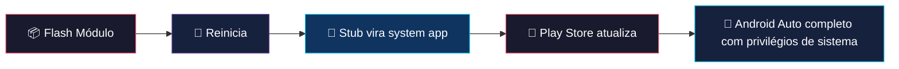
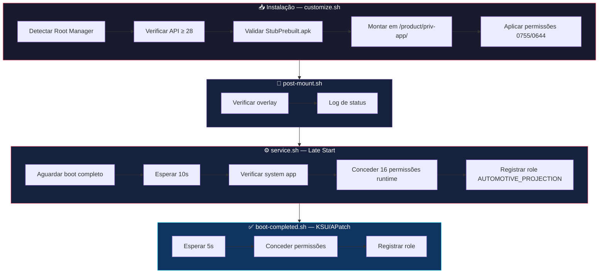

# 🚗 Android Auto Systemizer v4.0

<p align="center">
  
  
  
</p>

<p align="center">
  <a href="https://github.com/topjohnwu/Magisk"></a>
  <a href="https://github.com/tiann/KernelSU"></a>
  <a href="https://github.com/rifsxd/KernelSU-Next"></a>
  <a href="https://github.com/bmax121/APatch"></a>
</p>

<p align="center">
  <b>Módulo systemless que converte o Android Auto em aplicativo de sistema privilegiado (priv-app) com suporte completo a projeção automotiva.</b>
</p>

<p align="center">
  StubPrebuilt • RRO Overlay • 73 Permissões Privilegiadas • Anti-Bootloop • Multi-Root
</p>

---

## 📋 Índice

- [Visão Geral](#-visão-geral)
- [Como Funciona](#-como-funciona)
- [Componentes Instalados](#-componentes-instalados)
- [Compatibilidade](#-compatibilidade)
- [Instalação](#-instalação)
- [Arquitetura e Ciclo de Boot](#-arquitetura-e-ciclo-de-boot)
- [Permissões](#-permissões)
- [Proteção Anti-Bootloop](#-proteção-anti-bootloop)
- [Estrutura do Projeto](#-estrutura-do-projeto)
- [Troubleshooting](#-troubleshooting)
- [Changelog](#-changelog)
- [Créditos](#-créditos)

---

## 🔍 Visão Geral

**Android Auto Systemizer** é um módulo root que instala de forma **systemless** o Android Auto (`com.google.android.projection.gearhead`) como **aplicativo de sistema privilegiado** (`priv-app`) na partição `/product/`.

### Por que systemizar o Android Auto?

Muitas funcionalidades do Android Auto — como **projeção automotiva**, **acesso USB privilegiado**, **localização em segundo plano** e **serviços foreground persistentes** — exigem permissões de nível de sistema que só estão disponíveis para apps instalados em `/product/priv-app/`.

### Abordagem Técnica

O módulo utiliza a mesma abordagem do **NikGapps Addon**: instala o `AndroidAutoStubPrebuilt.apk` (APK stub oficial do Google) como app de sistema. Após a instalação e reinício, a **Google Play Store** detecta o stub e atualiza automaticamente para a versão completa do Android Auto, agora com todos os privilégios de sistema.

---

## ⚙️ Como Funciona



1. O módulo monta 3 arquivos via overlay systemless na partição `/product/`
2. O Android reconhece o `AndroidAutoStubPrebuilt` como app de sistema privilegiado
3. O XML de permissões concede 73 permissões privilegiadas automaticamente
4. O overlay RRO configura recursos do sistema para o Android Auto
5. A Play Store detecta o stub e oferece a atualização para a versão completa
6. Scripts de boot concedem permissões runtime e registram o role de projeção

---

## 📦 Componentes Instalados

O módulo instala **3 componentes** idênticos ao NikGapps AndroidAuto Addon:

| Componente | Caminho no Sistema | Tamanho | Função |
| :--- | :--- | :--- | :--- |
| **AndroidAutoStubPrebuilt.apk** | `/product/priv-app/AndroidAutoStubPrebuilt/` | 3.7 MB | APK stub oficial do Google — placeholder que a Play Store atualiza para a versão completa |
| **AndroidAutoOverlay.apk** | `/product/overlay/` | 12.3 KB | Runtime Resource Overlay (RRO) — configura o sistema para reconhecer o Android Auto como app nativo |
| **com.google.android.projection.gearhead.xml** | `/product/etc/permissions/` | 5.3 KB | Allowlist AOSP com 73 permissões privilegiadas |

> [!NOTE]
> Todos os 3 arquivos são **byte-a-byte idênticos** ao NikGapps Addon (SHA256 verificado). A única diferença é o método de instalação: NikGapps escreve direto na partição, nosso módulo usa overlay systemless.

---

## 🔧 Compatibilidade

### Soluções Root

| Plataforma | Versão | Status |
| :--- | :--- | :--- |
| **Magisk** | 20.0+ | ✅ Suporte Completo |
| **KernelSU** | Todas | ✅ Suporte Completo |
| **KernelSU Next** | 20000+ | ✅ Suporte Completo |
| **APatch** | Todas | ✅ Suporte Completo |

### Versões Android

| Android | API | Status |
| :--- | :--- | :--- |
| Android 9 (Pie) | API 28 | ✅ |
| Android 10 – 13 | API 29–33 | ✅ |
| Android 14 | API 34 | ✅ |
| Android 15 | API 35 | ✅ |
| Android 16 | API 36 | ✅ |

### ROMs Testadas

AOSP, Pixel, LineageOS, crDroid, EvolutionX, AxionOS, MIUI, HyperOS, OneUI, OxygenOS, ColorOS e outras.

> [!IMPORTANT]
> **KernelSU / KernelSU Next:** É necessário instalar um metamódulo (ex: `meta-overlayfs`) para que o módulo monte arquivos em `/system/`.

---

## 🚀 Instalação

1. Baixe o `AndroidAuto_Systemizer.zip` dos [Releases](https://github.com/antoniomalheirs/AndroidAuto_Systemizer/releases)
2. Abra seu gerenciador root (**Magisk**, **KernelSU** ou **APatch**)
3. Vá em **Módulos** → **Instalar do armazenamento** → selecione o ZIP
4. **Reinicie** o dispositivo
5. Abra a **Play Store** → busque **Android Auto** → **Atualizar** (o stub será atualizado para a versão completa)
6. Conecte ao carro e aproveite! 🎉

> [!TIP]
> Após reiniciar, verifique se funcionou: abra um terminal/ADB e execute:
> ```bash
> pm list packages -s | grep gearhead
> ```
> Se retornar `package:com.google.android.projection.gearhead`, o Android Auto é um app de sistema ✅

---

## 🏗️ Arquitetura e Ciclo de Boot



### Scripts do Módulo

| Script | Quando Executa | O Que Faz |
| :--- | :--- | :--- |
| `customize.sh` | Durante instalação | Valida componentes, configura permissões de arquivos |
| `post-mount.sh` | Após mount do overlay | Verifica montagem do OverlayFS (KSU/APatch) |
| `service.sh` | Late start service | Concede permissões runtime, registra role de projeção automotiva |
| `boot-completed.sh` | Após boot completo | Hook nativo KSU/APatch — redundância para permissões |
| `uninstall.sh` | Na remoção do módulo | Limpa cache do Android Auto |
| `system.prop` | No boot | Define `ro.control_privapp_permissions=log` (anti-bootloop) |
| `sepolicy.rule` | No boot | Políticas SELinux para acesso USB e binder IPC |

---

## 🔑 Permissões

### 73 Permissões Privilegiadas (XML Allowlist)

O módulo instala um allowlist AOSP completo em `/product/etc/permissions/` com **73 permissões**, incluindo:

<details>
<summary><b>Ver lista completa de permissões</b></summary>

| Categoria | Permissão | Função |
| :--- | :--- | :--- |
| 🔵 Bluetooth | `BLUETOOTH_PRIVILEGED` | Pareamento privilegiado |
| 🔵 Bluetooth | `BLUETOOTH_CONNECT` / `BLUETOOTH_SCAN` | Conexão e descoberta BT |
| 📍 Localização | `ACCESS_FINE_LOCATION` / `ACCESS_COARSE_LOCATION` | Navegação GPS |
| 📍 Localização | `LOCATION_HARDWARE` | Acesso direto ao hardware GPS |
| 📞 Telefonia | `MODIFY_PHONE_STATE` / `READ_PRIVILEGED_PHONE_STATE` | Controle de chamadas |
| 📞 Telefonia | `CALL_PRIVILEGED` / `CONTROL_INCALL_EXPERIENCE` | Chamadas privilegiadas |
| 📞 Telefonia | `REGISTER_CALL_PROVIDER` | Provedor de chamadas |
| 🚗 Projeção | `TOGGLE_AUTOMOTIVE_PROJECTION` | Ativar projeção automotiva |
| 🚗 Projeção | `ENTER_CAR_MODE_PRIORITIZED` | Modo carro priorizado |
| 🚗 Projeção | `REQUEST_COMPANION_PROFILE_AUTOMOTIVE_PROJECTION` | Perfil companion automotivo |
| 🔌 USB | `MANAGE_USB` | Gerenciar dispositivos USB |
| 🔊 Áudio | `MODIFY_AUDIO_ROUTING` | Roteamento de áudio privilegiado |
| 👤 Usuários | `INTERACT_ACROSS_PROFILES` / `MANAGE_USERS` | Interação multi-perfil |
| 🖥️ Display | `ADD_TRUSTED_DISPLAY` / `ADD_ALWAYS_UNLOCKED_DISPLAY` | Displays virtuais confiáveis |
| 🖥️ Display | `CREATE_VIRTUAL_DEVICE` / `CAPTURE_SECURE_VIDEO_OUTPUT` | Dispositivo virtual e captura |
| 📊 Sistema | `DUMP` / `UPDATE_APP_OPS_STATS` | Diagnóstico e estatísticas |
| 📊 Sistema | `START_ACTIVITIES_FROM_BACKGROUND` | Atividades em background |
| 📊 Sistema | `WRITE_SETTINGS` / `WRITE_SECURE_SETTINGS` | Configurações do sistema |
| 📊 Sistema | `CHANGE_COMPONENT_ENABLED_STATE` | Gerenciar componentes |
| 🌐 Rede | `TETHER_PRIVILEGED` | Tethering privilegiado |
| 🌐 Rede | `COMPANION_APPROVE_WIFI_CONNECTIONS` | Conexões WiFi companion |
| 🌐 Rede | `LOCAL_MAC_ADDRESS` | Endereço MAC local |
| 🔋 Energia | `POWER_SAVER` | Controle de economia de energia |
| 📱 Apps | `QUERY_ALL_PACKAGES` | Consultar todos os pacotes |
| 📱 Apps | `MANAGE_EXTERNAL_STORAGE` | Armazenamento externo |
| 🔔 Notificações | `RECEIVE_SENSITIVE_NOTIFICATIONS` | Notificações sensíveis |
| 📬 SMS | `SEND_SMS` / `RECEIVE_SMS` | Mensagens via carro |
| + | *e mais 20 permissões adicionais* | Funcionalidade completa |

</details>

### 16 Permissões Runtime (Concedidas no Boot)

Permissões do tipo "dangerous" que são concedidas automaticamente via `pm grant` em cada boot:

```
ACCESS_FINE_LOCATION, ACCESS_COARSE_LOCATION, ACCESS_BACKGROUND_LOCATION,
READ_PHONE_STATE, CALL_PHONE, READ_CONTACTS, RECORD_AUDIO,
POST_NOTIFICATIONS, BLUETOOTH_CONNECT, BLUETOOTH_SCAN,
NEARBY_WIFI_DEVICES, READ_CALENDAR, READ_CALL_LOG, SEND_SMS, RECEIVE_SMS
```

---

## 🛡️ Proteção Anti-Bootloop

O módulo implementa **3 camadas de proteção** contra bootloop:

### Camada 1: Propriedade de Sistema

```properties
ro.control_privapp_permissions=log
```

Quando definida como `log`, o Android **registra** erros de permissão no logcat em vez de **crashar** o `system_server`. Isso significa que mesmo que uma permissão do XML não exista na sua ROM específica, o dispositivo **sempre** inicializa normalmente.

> Referência: [source.android.com/docs/core/permissions/perms-allowlist](https://source.android.com/docs/core/permissions/perms-allowlist)

### Camada 2: Instalação Systemless

O módulo **NÃO** modifica nenhum arquivo real do sistema. Todos os arquivos são montados via overlay do Magisk/KSU. Se algo der errado:

- **Magisk:** Segure Volume Down por 30s durante o boot → módulos desativados
- **KSU/APatch:** Remova `/data/adb/modules/androidauto-systemizer/` via recovery
- **Qualquer root:** Desative o módulo no gerenciador root

### Camada 3: Scripts Defensivos

Todos os scripts usam `2>/dev/null` em cada comando. Nenhum erro de script pode afetar o processo de boot.

---

## 📂 Estrutura do Projeto

```
AndroidAuto_Systemizer/
├── system/product/
│   ├── priv-app/AndroidAutoStubPrebuilt/
│   │   └── AndroidAutoStubPrebuilt.apk    # APK stub oficial Google (3.7 MB)
│   ├── overlay/
│   │   └── AndroidAutoOverlay.apk         # RRO overlay (12.3 KB)
│   └── etc/permissions/
│       └── com.google.android.projection.gearhead.xml  # 73 permissões
│
├── customize.sh          # Script de instalação
├── service.sh            # Permissões runtime (Magisk)
├── boot-completed.sh     # Permissões runtime (KSU/APatch)
├── post-mount.sh         # Verificação de overlay
├── uninstall.sh          # Limpeza na remoção
├── module.prop           # Metadados do módulo
├── system.prop           # ro.control_privapp_permissions=log
├── sepolicy.rule         # Políticas SELinux
└── update_metada/
    ├── update.json       # Manifesto de atualização OTA
    └── CHANGELOG.md      # Histórico de versões
```

---

## 🔧 Troubleshooting

<details>
<summary><b>Android Auto não aparece como app de sistema</b></summary>

1. Execute: `pm list packages -s | grep gearhead`
2. Se vazio: verifique os logs do gerenciador root
3. **KernelSU:** instale um metamódulo (`meta-overlayfs`)
4. Reinstale o módulo e reinicie

</details>

<details>
<summary><b>"Dispositivo não compatível" na Play Store</b></summary>

Isso é causado pelo **Play Integrity API** (detecção de root), não pelo módulo. Instale um módulo de **Play Integrity Fix (PIF)** separadamente.

</details>

<details>
<summary><b>Play Store não oferece atualização do Android Auto</b></summary>

1. Abra a Play Store → busque "Android Auto" manualmente
2. Se não aparecer, limpe o cache da Play Store
3. Aguarde algumas horas — a Play Store pode demorar para detectar o stub

</details>

<details>
<summary><b>Conexão USB com o carro não funciona</b></summary>

1. Verifique SELinux: `getenforce` → deve ser `Enforcing`
2. O módulo adiciona acesso USB via `sepolicy.rule`
3. Use um cabo USB de dados (não apenas carregamento)
4. Verifique logs: `logcat -s AndroidAutoSystemizer`

</details>

<details>
<summary><b>Wireless Android Auto não conecta</b></summary>

1. Verifique permissões BT: `dumpsys package com.google.android.projection.gearhead | grep BLUETOOTH`
2. O módulo concede `BLUETOOTH_CONNECT`, `BLUETOOTH_SCAN` e `NEARBY_WIFI_DEVICES` no boot
3. Limpe dados do Android Auto e re-pareie com o carro

</details>

<details>
<summary><b>KernelSU: módulo não funciona</b></summary>

1. Instale um metamódulo (`meta-overlayfs`) → Reinicie → Reinstale este módulo → Reinicie
2. Verifique se o módulo está ativado no KernelSU Manager
3. Verifique se o UID do módulo tem permissão de root

</details>

---

## 📝 Changelog

### v4.0 — Rewrite com StubPrebuilt (Atual)

- **Nova abordagem:** Usa `AndroidAutoStubPrebuilt.apk` (stub oficial Google) em vez de extrair APKs split
- **RRO Overlay:** Inclui `AndroidAutoOverlay.apk` para configuração nativa do sistema
- **73 permissões:** Allowlist completa baseada no NikGapps Addon (vs. 22 da v3.0)
- **Compatibilidade:** Arquivos idênticos ao NikGapps Addon (SHA256 verificado)
- **16 permissões runtime:** Adicionadas `READ_CALENDAR`, `READ_CALL_LOG`, `SEND_SMS`, `RECEIVE_SMS`

### v3.0 — Rewrite de Segurança

- Remoção de XMLs duplicados entre partições
- Proteção anti-bootloop via `ro.control_privapp_permissions=log`
- Scripts 100% defensivos com supressão de erros
- Remoção de regras SELinux redundantes

### v2.0 — Multi-Root

- Suporte a Magisk, KernelSU, KernelSU Next e APatch
- Extração automática de APKs via `pm path`
- Concessão automática de permissões runtime

### v1.0 — Release Inicial

- Instalação básica do Android Auto como priv-app
- Suporte apenas para Magisk

---

## 🔄 Atualização OTA

O módulo suporta atualização automática via `updateJson`. Seu gerenciador root verificará automaticamente novas versões.

**URL:** `https://raw.githubusercontent.com/antoniomalheirs/AndroidAuto_Systemizer/main/update_metada/update.json`

---

## 👏 Créditos

| Contribuidor | Contribuição |
| :--- | :--- |
| [**topjohnwu**](https://github.com/topjohnwu) | Criador do Magisk |
| [**tiann**](https://github.com/tiann) | Criador do KernelSU |
| [**NikGapps**](https://nikgapps.com/) | Referência para a abordagem StubPrebuilt + Overlay |
| [**SentinelData**](https://github.com/antoniomalheirs) | Desenvolvimento do módulo |

---

<p align="center">
  <b>Sentinel Data Solutions</b> | <i>Mobile Experience Engineering</i><br/>
  <b>Developed by Zeca</b>
</p>

<p align="center">
  ⭐ Se este módulo melhorou sua experiência com o Android Auto, considere dar uma estrela no repositório!
</p>
